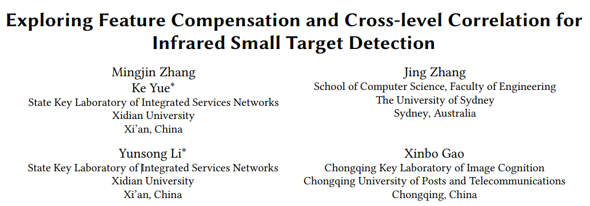
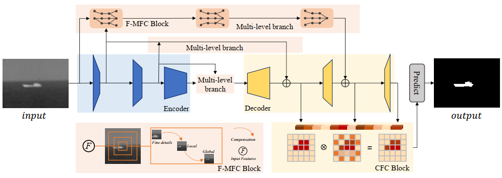
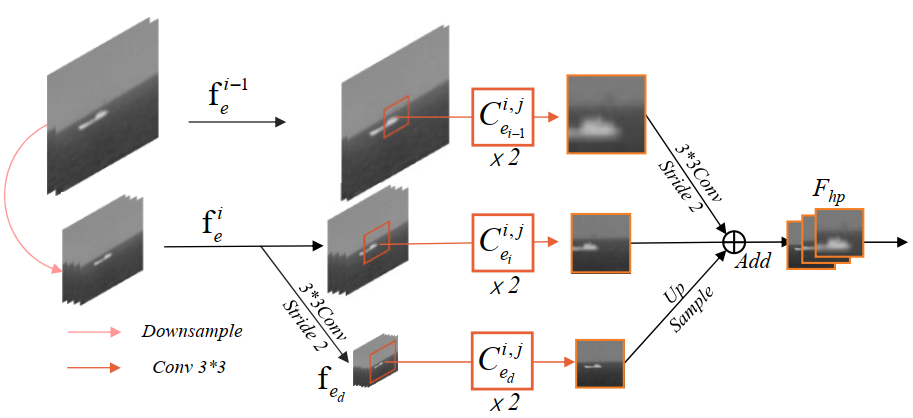
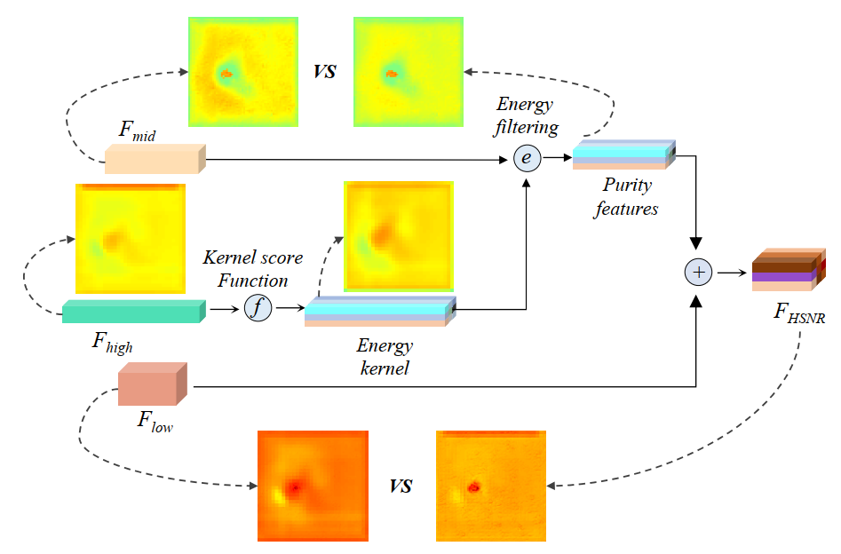

# This is a demo of the paper "Exploring Feature Compensation and Cross-level Correlation for Infrared Small Target Detection".
</img>
# Details of the network
#Overall structure
</img>
#F-MFC
</img>
#CFC
</img>
# Please cite this paper if it is helpful to you.

Zhang, M., Yue, K., Zhang, J., Li, Y., & Gao, X. (2022, October). Exploring Feature Compensation and Cross-level Correlation for Infrared Small Target Detection. In Proceedings of the 30th ACM International Conference on Multimedia (pp. 1857-1865).

